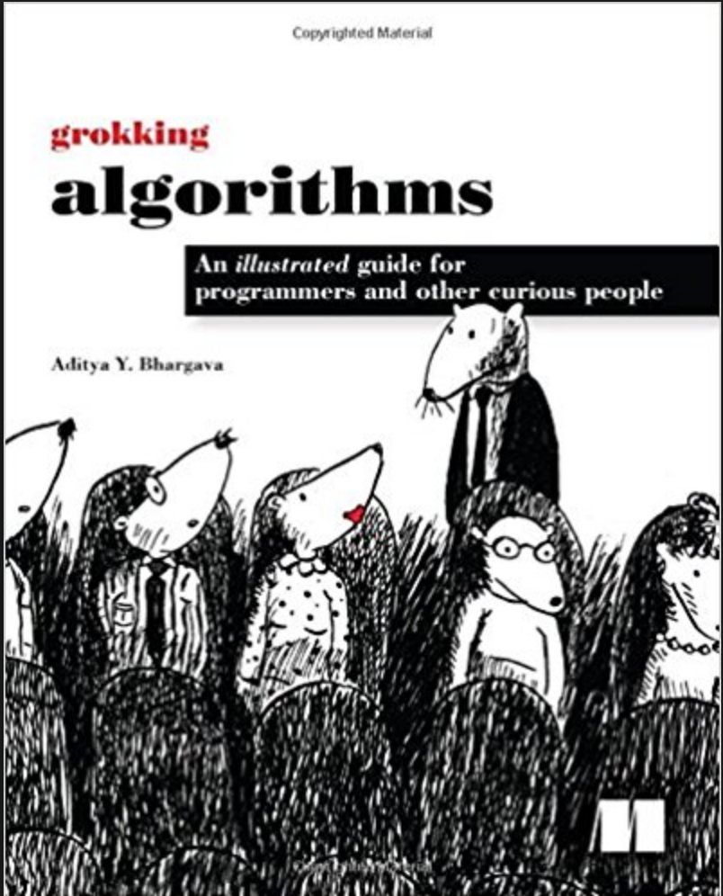
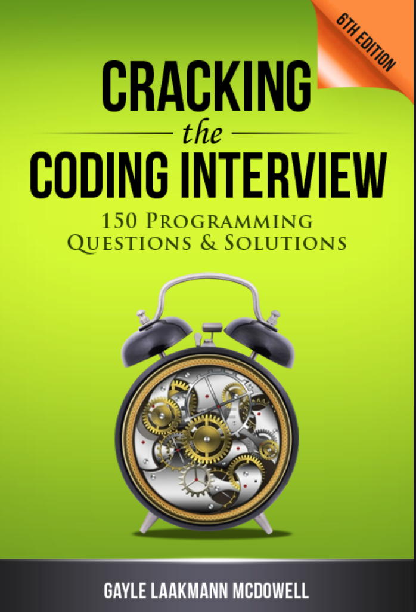

How to Prepare for a Coding Interview
====

<strong>  How software engineers get a job in Silicon Valley ?  </strong>
<strong>  How they prepare for coding interviews ?  </strong>

If you want to get a good job as an engineer, what you should do and how to prepare ?
To land one of popular jobs, you'll have to be strategic about it.
I was curious how top-notch software engineers got a job from big four(Google, Microsoft, Amazon, Facebook) in Silicon Valley and how they prepared in advance.

I heard that some used to go to Silicon valley to get these jobs from overseas.
They just landed to San Francisco without any connection nor visa, and got hired from a top company.  
How did they do that ? Is that still possible ? How competitive it is ?  

Getting a job as an engineer in Silicon Valley from oversea is getting much harder because of U.S. visa system.
But it's good to know how you should make a strategy to get a job though you learn how engineers in Silicon Valley prepared to get these job.
I summarize what I learned through reading lots of blogs and websites on the internet.

## Step for Preparation

### Picking a Programming Language
- Python, C, Java are recommended since lots of coding interview book has solutions in those languages
- Most companies will let you code in any language you want, the only exception I have heard Google, where they only allow candidates to pick from Java, C++ or Python for their algorithmic coding interviews.
- Use a language you are extremely familiar with.
- [We analyzed thousands of technical interviews on everything from language to code style. Here’s what we found.](http://blog.interviewing.io/what-really-matters-in-technical-interviews-we-analyzed-thousands-of-interviews-on-everything-from-language-to-code-style-heres-what-we-found/)

### Basic Skills
- [freeCodeCamp](https://medium.freecodecamp.org/)
    I read an article [How I went from zero to San Francisco software engineer in 12 months](https://medium.freecodecamp.org/how-i-learned-to-code-and-earned-a-job-in-silicon-valley-changing-my-life-along-the-way-a3af854855fa),
    the writer joined freeCodeCamp to gain skills.

### Coding Interview

- [Grokking Algorithms](https://www.amazon.com/Grokking-Algorithms-illustrated-programmers-curious/dp/1617292230)

- [Cracking Coding Interview](https://www.amazon.com/Cracking-Coding-Interview-Programming-Questions/dp/0984782850/ref=pd_bxgy_14_img_2/140-9673059-2333521?_encoding=UTF8&pd_rd_i=0984782850&pd_rd_r=7748ecf8-7b09-11e8-a9fc-2715f6184f1b&pd_rd_w=fxy4t&pd_rd_wg=wRHY7&pf_rd_i=desktop-dp-sims&pf_rd_m=ATVPDKIKX0DER&pf_rd_p=3914568618330124508&pf_rd_r=TMNV18M4Y2SBNTNG41KE&pf_rd_s=desktop-dp-sims&pf_rd_t=40701&psc=1&refRID=TMNV18M4Y2SBNTNG41KE)

### Collect Tips You Talk in Interviews
- Introduction
- Your personal project
- Side Project
- CV
    Write what you want they to ask.

### Search Jobs Online

- [LinkedIn](https://www.linkedin.com/in/haruna-waizumi-7ab75bb8/)
- [HackerNews](https://news.ycombinator.com/jobs)
- [AngelList](https://angel.co/)
- [Hired.com](https://hired.com/)
- [TRIPLEBYTE](https://triplebyte.com/)

    This company has connection with Y Combinator. You need to pass coding exams and interviews.
    but I'm pretty sure you could get some good information.

## Organize Information

- Google Calendar
    Add schedule in google calendar to avoid cluttered and  confusing.

- Evernote
    What they asked
    What you answered

### Coding Interview Preparation

1. [GeeksforGeeks](https://www.geeksforgeeks.org/)

    Must to learn (Highly recommended!!)
    To learn basic
    No way to avoid. Just repeat practice.

2. [Leetcode](https://leetcode.com/)

    Conquer all 70 EASY LEVEL questions completely
    No need to solve all 700 questions
    Takes 2hours for solving one question. But no worry.
    Understand each question perfectly. That's important.

3.  Others

    [Interview Cake](https://www.interviewcake.com/)
    [HackerRank](https://www.hackerrank.com/)
        14days free trial

## Behavior In Interviews

- Be professional
- Understand your leverage
    You could produce a better result beyond your abilities to take advantage of your strong points anyone else has.
- Be genuinely interested in the teams and projects
- Be determined but polite
- Never lie
- Sensitivity Japanese has would be one of your strong points
- Tech companies don't care how much you want to join, they only care how much skill you have.

## Popular Tech Countries in the World

- Singapore
    Getting easier to get a visa.

- Canada
    No graduate recruitment system(新卒採用)
    Intern system is popular (3-6 months)
    No payments/poor payments in internship
    Recommended you start working as an internship to get full-time job later.
    Otherwise, hunting job while you are working in an internship.
    Waterloo in Toronto has lots of tech companies.

    #### Recruiting Website

    -  [kijiji](https://www.kijiji.ca/b-jobs/gta-greater-toronto-area/c45l1700272)
    -  [craigslist](https://toronto.craigslist.ca/)
    -  [Monster](https://www.monster.com/)

- USA
    Getting a visa in US is not feasible.
    Some used to get H-1B visa, which opens April 1.
    It's fully reserved quickly.

## How to Use This Github Code

As I mentioned above, preparing for coding interview with 'Grokking Algorithms' and 'Cracking Coding Interview' seem are the best way.
These are the answers in Javascript for questions in these two books.
The reason why I posted these solutions on Gihub is that I couldn't find lots of well organized lists of solutions of these coding questions in Javascript.
I hope it would help you to learn these books and to get a good job !

## 'Grokking Algorithms'

### Programming Solutions
- <strong>  01_Binary_search ~ 09_Dynamic_programming  </strong> 
- in Javascript

### What I liked 'Grokking Algorithms' ?
Well, to be honest, I like the whole book, from Introduction to end.
[Grokking Algorithms](https://www.amazon.com/Grokking-Algorithms-illustrated-programmers-curious/dp/1617292230) is the best book I've ever read on algorithms.
 I don't have a degree of software engineering but I understood this book easily. That's amazing, isn't it ?

1. Easy to understand language.

2. Interesting pictures which help to visualize working of algorithms and data structures.

3. Thought to provoke use cases e.g when you have to design an app to keep track of your expense where you need to add and remove items more regularly and viewing it once or twice in a month, which data structure will you use?

4. Contemporary examples make it even more interesting. For example, how Facebook stores username so that they can allow you to log in and handle signups? Array or linked list or a hybrid data structure which is made of an array and linked list.

5. Size of the book, yes, it's not overwhelming so more chances that you will read it and come back again.

6. Covers essential data structure e.g. array, linked list, and hash table.

These were some of the points which I like but overall Grokking Algorithms is a very readable book with lots of good pictures which make this difficult topic relatively easy to understand.

## 'Cracking Coding Interview'

### Programming Solutions
- <strong> CC_00_Big0 ~ CC_10_Sorting_and_Searching  </strong>
- in Javascript

### What I liked 'Cracking Coding Interview' ?

[Cracking Coding Interview](https://www.amazon.com/Cracking-Coding-Interview-Programming-Questions/dp/0984782850/ref=pd_bxgy_14_img_2/140-9673059-2333521?_encoding=UTF8&pd_rd_i=0984782850&pd_rd_r=7748ecf8-7b09-11e8-a9fc-2715f6184f1b&pd_rd_w=fxy4t&pd_rd_wg=wRHY7&pf_rd_i=desktop-dp-sims&pf_rd_m=ATVPDKIKX0DER&pf_rd_p=3914568618330124508&pf_rd_r=TMNV18M4Y2SBNTNG41KE&pf_rd_s=desktop-dp-sims&pf_rd_t=40701&psc=1&refRID=TMNV18M4Y2SBNTNG41KE)is by far the most popular interview prep book for software engineers. It’s a great book.
A lot of people recommended.

1. The first quality book to provide a large collection of interview problems that were representative of what you'd be likely to be asked in a tech giant company interview.

2. Historical significance. The content is still relevant today — coding interviews have changed a little, but not that much.

3. The solutions to each problem are explained very clearly and thoroughly, and about as simply as possible (for the required level of complexity) in almost every case.

### How to Use This Book
1. Read a whole book (You can skip some chapters if you don't have time)
2. Solve questions
Don't go to the next question without understanding
3. Repeat questions

#### Tips
Most of big companies like Microsoft, Amazon, Facebook, Twitter use similar questions
It was written for a few years ago, and software engineering interviews seem to have changed in the meantime, at least in the Silicon Valley engineering culture. Check [Studying for startup interviews with 'Cracking the Coding Interview'](http://shlegeris.com/2016/06/22/ctci). You can see which questions are more relevant.

## Top Algorithms and Data Structures You Really Need To Know
- Searching
- Linear search
- Binary search
- Sorting
- MergeSort
- QuickSort
- Trees
- Graphs
    - BFS(Breadth First Search)
    - DFS(Depth First Search)
    - Dynamic programming(DP)
    - Hashing
    - String pattern matching

- linked lists
- Arrays
- Queues
- Recursion

## Reference Materials
[TCP/IP(https://www.khanacademy.org/computing/computers-and-internet/xcae6f4a7ff015e7d:the-internet/xcae6f4a7ff015e7d:transporting-packets/a/transmission-control-protocol--tcp)

[10 Interview Questions
Every JavaScript Developer Should Know](https://medium.com/javascript-scene/10-interview-questions-every-javascript-developer-should-know-6fa6bdf5ad95)

[What are fundamentals you should know before a technical interview?](https://www.quora.com/What-are-fundamentals-you-should-know-before-a-technical-interview)

[Coding Interview University](https://github.com/jwasham/coding-interview-university)

[The 30-minute guide to rocking your next coding interview](https://medium.freecodecamp.org/coding-interviews-for-dummies-5e048933b82b)

[Cracking Coding Interview](https://www.amazon.co.jp/Cracking-Coding-Interview-Programming-Questions/dp/0984782850)

[BigOcheatSheet](http://bigocheatsheet.com/)

[Engineer Employment Blog](https://postd.cc/tag/engineer-employment/)

[Data Scientist TopCode](https://www.topcoder.com/community/data-science/data-science-tutorials/)

[What? Interview coaching from Googlers! ](http://blog.gainlo.co/index.php/2017/03/03/chapter-3-practice-coding-questions-complete-guide-google-interview-preparation/?utm_campaign=quora&utm_medium=How+effective+is+Leetcode+for+preparing+for+technical+interviews%3F&utm_source=quora)

[best-programming-language-jobs](http://blog.codingforinterviews.com/best-programming-language-jobs/)

[How-do-I-prepare-for-a-software-engineering-job-interview](https://www.quora.com/How-do-I-prepare-for-a-software-engineering-job-interview)

## Contribution
Feel free to fork and create a Pull Request.

